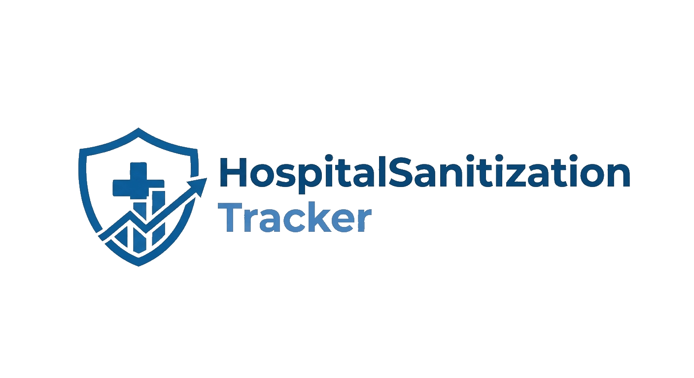

<div align="center">

 

# HospitalSanitizationTracker

**DApp per la tracciabilità delle attività di sanificazione ospedaliera tramite blockchain**


*Progetto per il corso di **Blockchain e Criptovalute** – Università di Bologna*  
*Proposal 7 – DLTs for Traceability in Supply Chain (AnaNSi Research Group)*

</div>

---

## Indice

1. [Descrizione](#descrizione)
2. [Tecnologie Utilizzate](#tecnologie-utilizzate)
3. [Architettura e Struttura Progetto](#architettura-e-struttura-progetto)
4. [Smart Contract – Funzionalità](#smart-contract--funzionalit%C3%A0)
5. [Frontend DApp – Funzionalità](#frontend-dapp--funzionalit%C3%A0)
6. [Installazione e Utilizzo](#installazione-e-utilizzo)
7. [Contratto Deployato](#contratto-deployato)
8. [Autore](#autore)

---

## Descrizione

Sistema basato su smart contract Ethereum che permette a operatori autorizzati di **registrare e certificare le operazioni di sanificazione** di aree ospedaliere.

Ogni evento è registrato in modo **immutabile sulla blockchain** e può essere consultato in qualsiasi momento, garantendo trasparenza e non-ripudiabilità dei dati.

---

## Tecnologie Utilizzate

| Tecnologia | Versione | Ruolo |
|---|---|---|
| Solidity | 0.8.20 | Linguaggio smart contract |
| Hardhat | 2.28.0 | Framework sviluppo/test/deploy |
| Ethers.js | v6 | Interazione contratto dal frontend |
| Node.js | v22 | Runtime JavaScript |
| Infura | – | RPC Provider (Sepolia) |
| MetaMask | – | Wallet per firma transazioni |
| Ethereum Sepolia | Testnet | Rete di deploy |

---

## Architettura e Struttura Progetto

```
HospitalSanitizationTracker/
├── contracts/
│   └── SanitizationTracker.sol     # Smart contract principale
├── scripts/
│   └── deploy.js                   # Script di deploy locale
├── ignition/
│   └── modules/
│       └── SanitizationTracker.js   # Modulo Hardhat Ignition (deploy testnet)
├── test/
│   └── SanitizationTracker.test.js # Suite di test (14/14)
├── frontend/
│   ├── index.html                  # Interfaccia web DApp
│   ├── app.js                      # Logica DApp + interazione contratto
│   └── style.css                   # Stili
├── hardhat.config.js
├── package.json
└── .env                            # (locale, non versionato)
```

---

## Smart Contract – Funzionalità

Il contratto `SanitizationTracker.sol` implementa le seguenti funzionalità:

### Strutture Dati

| Struct | Campi principali |
|---|---|
| `Area` | `id`, `name`, `active`, `exists` |
| `Operator` | `wallet`, `name`, `active`, `exists` |
| `SanitizationEvent` | `areaId`, `operatorAddress`, `timestamp`, `outcome`, `notes` |

### Funzioni Principali

| Funzione | Accesso | Descrizione |
|---|---|---|
| `registerArea(id, name)` | `onlyAdmin` | Registra una nuova area |
| `setAreaActive(id, active)` | `onlyAdmin` | Attiva/disattiva un'area |
| `registerOperator(wallet, name)` | `onlyAdmin` | Registra un nuovo operatore |
| `setOperatorActive(wallet, active)` | `onlyAdmin` | Attiva/disattiva un operatore |
| `sanitize(areaId, outcome, notes)` | `onlyActiveOperator` | Registra evento di sanificazione |
| `getAreaEvents(areaId)` | pubblico | Ritorna lo storico completo |
| `getLastSanitization(areaId)` | pubblico | Ritorna l'ultimo evento |
| `getEventCount(areaId)` | pubblico | Ritorna il numero di eventi |

### Modificatori di Accesso

- **`onlyAdmin`** → solo il deployer del contratto
- **`onlyActiveOperator`** → solo operatori registrati e attivi

### Eventi On-Chain

- `AreaRegistered(id, name)`
- `OperatorRegistered(wallet, name)`
- `AreaSanitized(areaId, operator, timestamp, outcome)`

---

## Frontend DApp – Funzionalità

La cartella `frontend/` contiene una DApp web completa che si connette al contratto tramite MetaMask.

### Ruoli

| Ruolo | Descrizione |
|---|---|
| **Admin** | Account deployer; può registrare aree e operatori |
| **Operator** | Account registrato dall'admin; può registrare sanificazioni |
| **Guest** | Account non riconosciuto; accesso in sola lettura |

> La DApp rileva automaticamente il ruolo leggendo l'`admin` address e la mappa degli `operators` direttamente dal contratto.

### Sezioni dell'Interfaccia

| # | Sezione | Ruolo richiesto | Funzione |
|---|---|---|---|
| 1 | **Header** | – | Connessione MetaMask, indirizzo connesso, ruolo rilevato |
| 2 | **Register Area** | Admin | Registra una nuova area (`ID` + `Name`) |
| 3 | **Register Operator** | Admin | Registra un operatore (`Wallet Address` + `Name`) |
| 4 | **Record Sanitization** | Operator | Registra evento (`Area ID`, `Outcome`, `Notes`) |
| 5 | **Area Status** | Tutti | Visualizza dati area + ultima sanificazione |
| 6 | **Area Events** | Tutti | Storico completo eventi per area |

---

## Installazione e Utilizzo

### Prerequisiti

- Node.js v22+
- MetaMask installato nel browser
- Account Sepolia con ETH di test ([Sepolia Faucet](https://sepoliafaucet.com/))

### Setup

```bash
# 1. Clona il repository
git clone https://github.com/FrancescoCastaldi/HospitalSanitizationTracker.git
cd HospitalSanitizationTracker

# 2. Installa le dipendenze
npm install

# 3. Crea il file .env
cp .env.example .env
# Poi compila: INFURA_API_KEY=... e PRIVATE_KEY=...
```

### Comandi

```bash
# Compila il contratto
npx hardhat compile

# Esegui i test
npx hardhat test

# Deploy su Sepolia (Hardhat Ignition)
npx hardhat ignition deploy ignition/modules/SanitizationTracker.js --network sepolia
```

### Avvio Frontend

```bash
npx serve frontend
# oppure: estensione "Live Server" di VS Code
```

Aprire il browser su `http://localhost:3000` e selezionare la rete **Sepolia** in MetaMask.

### Flusso Tipico di Utilizzo

```
1. Connetti con account Admin (deployer)
   └→ Registra un'area  (es. ID=101, Name="Sala Operatoria")
   └→ Registra un operatore (wallet del 2° account MetaMask)

2. Cambia account in MetaMask → Operatore
   └→ Registra una sanificazione (Area 101, Outcome: OK, Notes: ...)

3. Con qualsiasi account
   └→ Consulta Area Status e Area Events per verificare lo storico
```

---

## Contratto Deployato

| Campo | Valore |
|---|---|
| **Rete** | Ethereum Sepolia Testnet |
| **Indirizzo** | `0x679C6625f9479cf3b711F7a246C8F7a6655E4517` |
| **Data Deploy** | 21 Febbraio 2026 |
| **Etherscan** | [Visualizza su Sepolia Etherscan](https://sepolia.etherscan.io/address/0x679C6625f9479cf3b711F7a246C8F7a6655E4517) |

---

## Autore

**Francesco Castaldi**  
Università di Bologna – Corso di Blockchain e Criptovalute

---

<div align="center">

*Progetto sviluppato a scopo accademico*

</div>
