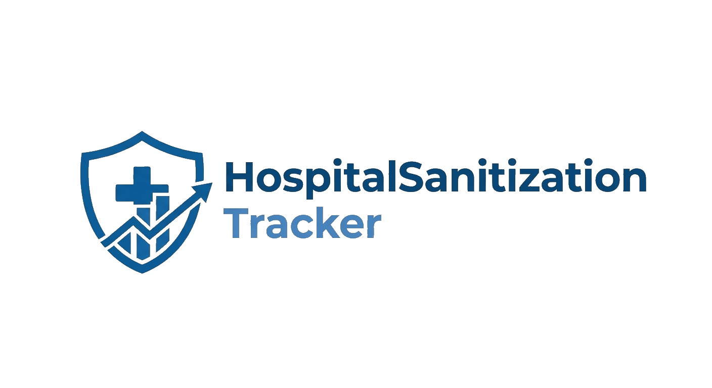

<div align="center">



# 🏥 HospitalSanitizationTracker

**A blockchain-based DApp for traceability of hospital sanitization activities**

[](https://github.com/FrancescoCastaldi/HospitalSanitizationTracker/actions/workflows/ci.yml)
[](https://soliditylang.org/)
[](https://hardhat.org/)
[](https://nodejs.org/)
[](https://sepolia.etherscan.io/address/0x679C6625f9479cf3b711F7a246C8F7a6655E4517)
[]()
[](LICENSE)
[](https://sepolia.etherscan.io/address/0x679C6625f9479cf3b711F7a246C8F7a6655E4517)

*Project for the **Blockchain and Cryptocurrencies** course – University of Bologna*  
*Proposal 7 – DLTs for Traceability in Supply Chain (AnaNSi Research Group)*

</div>

---

## Table of Contents

1. [Description](#description)
2. [Tech Stack](#tech-stack)
3. [Architecture & Project Structure](#architecture--project-structure)
4. [Smart Contract – Features](#smart-contract--features)
5. [Frontend DApp – Features](#frontend-dapp--features)
6. [Installation & Usage](#installation--usage)
7. [Deployed Contract](#deployed-contract)
8. [Author](#author)

---

## Description

An Ethereum smart contract-based system that allows authorized operators to **register and certify sanitization operations** of hospital areas.

Every event is recorded **immutably on the blockchain** and can be queried at any time, guaranteeing transparency and non-repudiation of data.

---

## Tech Stack

| Technology | Version | Role |
|---|---|---|
| Solidity | 0.8.20 | Smart contract language |
| Hardhat | 2.28.0 | Development / test / deploy framework |
| Ethers.js | v6 | Contract interaction from frontend |
| Node.js | v22 | JavaScript runtime |
| Infura | – | RPC Provider (Sepolia) |
| MetaMask | – | Wallet for transaction signing |
| Ethereum Sepolia | Testnet | Deployment network |

---

## Architecture & Project Structure

```
HospitalSanitizationTracker/
├── .github/
│   └── workflows/
│       └── ci.yml                       # GitHub Actions CI pipeline
├── contracts/
│   └── SanitizationTracker.sol          # Main smart contract
├── scripts/
│   └── deploy.js                        # Local deploy script
├── ignition/
│   └── modules/
│       └── SanitizationTracker.js       # Hardhat Ignition module (testnet deploy)
├── test/
│   └── SanitizationTracker.test.js      # Test suite (14/14)
├── frontend/
│   ├── index.html                       # DApp web interface
│   ├── app.js                           # DApp logic + contract interaction
│   └── style.css                        # Styles
├── Photos/
│   └── logo.png
├── artifacts/                           # Compilation output (gitignored)
├── cache/                               # Hardhat cache (gitignored)
├── hardhat.config.js
├── package.json
├── .env.example                         # Environment variables template
└── .gitignore
```

---

## Smart Contract – Features

The `SanitizationTracker.sol` contract implements the following:

### Data Structures

| Struct | Main Fields |
|---|---|
| `Area` | `id`, `name`, `active`, `exists` |
| `Operator` | `wallet`, `name`, `active`, `exists` |
| `SanitizationEvent` | `areaId`, `operatorAddress`, `timestamp`, `outcome`, `notes` |

### Main Functions

| Function | Access | Description |
|---|---|---|
| `registerArea(id, name)` | `onlyAdmin` | Register a new area |
| `setAreaActive(id, active)` | `onlyAdmin` | Enable/disable an area |
| `registerOperator(wallet, name)` | `onlyAdmin` | Register a new operator |
| `setOperatorActive(wallet, active)` | `onlyAdmin` | Enable/disable an operator |
| `sanitize(areaId, outcome, notes)` | `onlyActiveOperator` | Record a sanitization event |
| `getAreaEvents(areaId)` | public | Returns full event history |
| `getLastSanitization(areaId)` | public | Returns last event |
| `getEventCount(areaId)` | public | Returns event count |

### Access Modifiers

- **`onlyAdmin`** → deployer address only
- **`onlyActiveOperator`** → registered and active operators only

### On-Chain Events

- `AreaRegistered(id, name)`
- `OperatorRegistered(wallet, name)`
- `AreaSanitized(areaId, operator, timestamp, outcome)`

---

## Frontend DApp – Features

The `frontend/` folder contains a full web DApp that connects to the contract via MetaMask.

### Roles

| Role | Description |
|---|---|
| **Admin** | Deployer account; can register areas and operators |
| **Operator** | Account registered by admin; can record sanitizations |
| **Guest** | Unrecognized account; read-only access |

> The DApp automatically detects the role by reading the `admin` address and the `operators` mapping directly from the contract.

### Interface Sections

| # | Section | Required Role | Function |
|---|---|---|---|
| 1 | **Header** | – | MetaMask connection, connected address, detected role |
| 2 | **Register Area** | Admin | Register a new area (`ID` + `Name`) |
| 3 | **Register Operator** | Admin | Register an operator (`Wallet Address` + `Name`) |
| 4 | **Record Sanitization** | Operator | Record event (`Area ID`, `Outcome`, `Notes`) |
| 5 | **Area Status** | All | Display area data + last sanitization |
| 6 | **Area Events** | All | Full event history for an area |

---

## Installation & Usage

### Prerequisites

- Node.js v22+
- MetaMask installed in the browser
- Sepolia account with test ETH ([Sepolia Faucet](https://sepoliafaucet.com/))

### Setup

```bash
git clone https://github.com/FrancescoCastaldi/HospitalSanitizationTracker.git
cd HospitalSanitizationTracker
npm install
cp .env.example .env
# Edit .env with your INFURA_API_KEY and PRIVATE_KEY
```

### Commands

```bash
# Compile the contract
npx hardhat compile

# Run tests
npx hardhat test

# Deploy to Sepolia (Hardhat Ignition)
npx hardhat ignition deploy ignition/modules/SanitizationTracker.js --network sepolia
```

### Start Frontend

```bash
npx serve frontend
# or use the "Live Server" extension in VS Code
```

Open the browser at `http://localhost:3000` and select the **Sepolia** network in MetaMask.

### Typical Usage Flow

```
1. Connect with Admin account (deployer)
   └→ Register an area  (e.g. ID=101, Name="Operating Room")
   └→ Register an operator (wallet of 2nd MetaMask account)

2. Switch account in MetaMask → Operator
   └→ Record a sanitization (Area 101, Outcome: OK, Notes: ...)

3. With any account
   └→ Check Area Status and Area Events to verify the history
```

---

## Deployed Contract

| Field | Value |
|---|---|
| **Network** | Ethereum Sepolia Testnet |
| **Address** | [`0x679C6625f9479cf3b711F7a246C8F7a6655E4517`](https://sepolia.etherscan.io/address/0x679C6625f9479cf3b711F7a246C8F7a6655E4517) |
| **Deploy Date** | February 21, 2026 |
| **Etherscan** | [View on Sepolia Etherscan](https://sepolia.etherscan.io/address/0x679C6625f9479cf3b711F7a246C8F7a6655E4517) |

---

## Author

**Francesco Castaldi**  
University of Bologna – Blockchain and Cryptocurrencies Course

[](https://github.com/FrancescoCastaldi)

---

<div align="center">

*Project developed for academic purposes*

</div>
